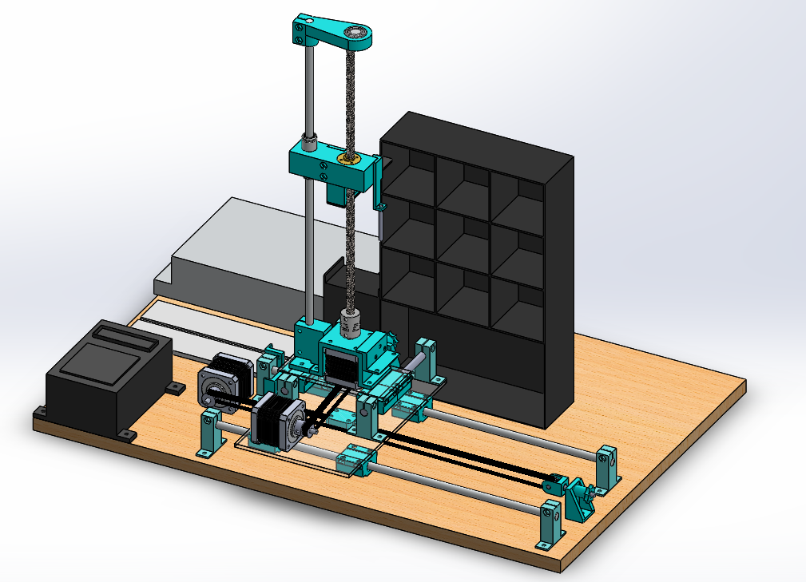
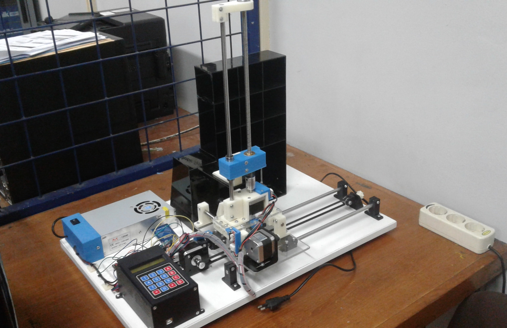

# ASRS-Mechatronics-Prototype-Design-

This Program is created by Billy Sagara for Bachelor Thesis Completion
       [2019-08] Copyrighted by Catholic Parahyangan University 

This repository shares the Arduino code that I made for designing a prototype of AS/RS machine [Automated Storage and Retrieval System] following Mechatronics IoT Design Principle.  
It is a single code that includes all the controls of both sensors and actuators. 

Please feel free to look, copy, and modify the code, but if you do so, please ensure that you provide attribution by referencing the original author. 
Apache License 2.0

1 File Program consists of three sections;
- define stage (defining pins, etc)
- initial stage (setting initial value)
- loop stage (main contents: input and output process)

Electronics hardware components that are used are as follows:
1. Arduino Mega2560 
2. RAMP 1.4 Shield 
3. NEMA 17 Stepper Motor 
4. 3 Limit Switches (for each axes movement)
5. Keypad (Coordinate Inputs)
7. RFID Sensors and RFID Cards [Will be replaced by Barcode Scanner later in the future]
8. LCD Display 
9. Push Buttons (for manual adjustment input)
10. Power Supply 12V 20A
11. Potentiometer or possibly variable resistor.

Electronic Schematic: 

CAD Mechanical Design: 

End/Finish Product: 

All the design image is included in the repository except the CAD file.   
For more information regarding the mechanical components, test results, and detailed analysis, please refer to my published research paper.  
IOP Conference Series: Materials Science and Engineering

